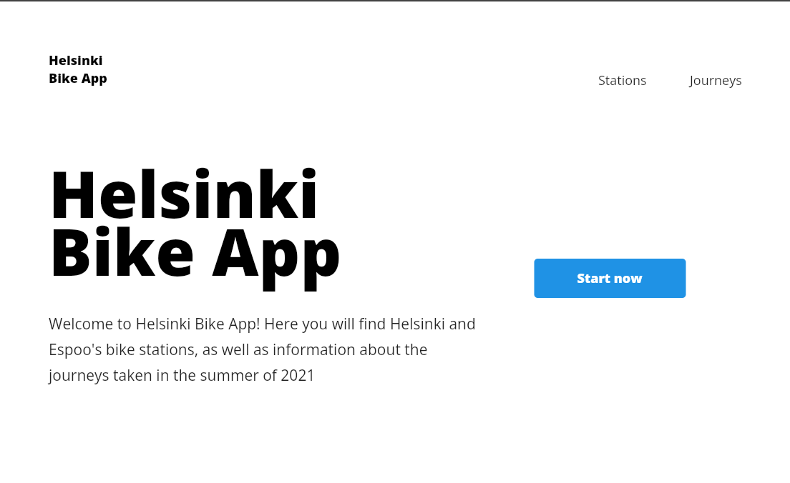
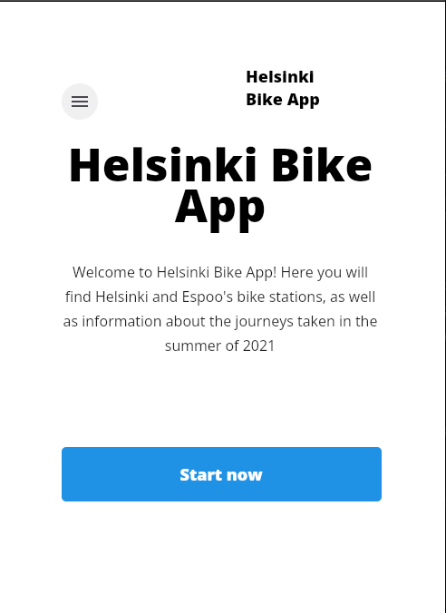
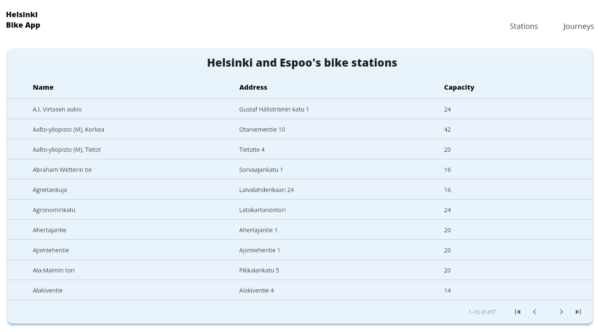
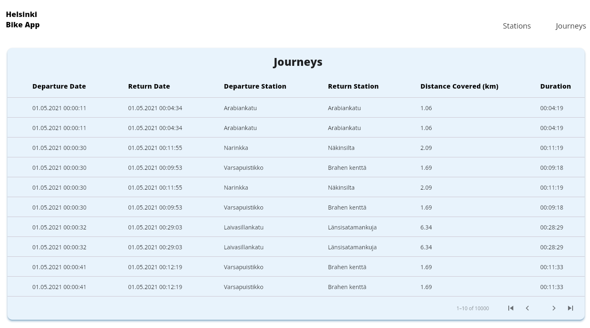
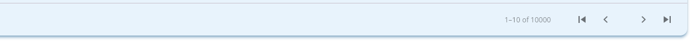

# Helsinki Bike App

This project is a submission to [Solita Dev Academy 2023](https://github.com/solita/dev-academy-2023-exercise) pre-assignment. It provides a full-stack web application to view information about Helsinki and Espoo's bike stations as well as bike journeys taken in the summer of 2021.

The project consists of a user interface, a [backend service](https://github.com/SRH8/hel-bike-api) to fetch the data and an [extra utility to import the data to a database](https://github.com/SRH8/hel-bike-data-import). Each of these parts is uploaded in its own repository. I recommend that you also take a look at them before running the user interface, as they contain detailed information about those parts as well as instructions on how to run the backend locally and set up a database. However, running the backend service locally and setting up the database is not necessary (if you wish to only run the UI), as the UI can make use of the live backend.


## About the project (UI)

This project was made with [Flutter](https://flutter.dev/), Google's portable UI Framework. Flutter is an open source framework that allows developers to build beautiful, natively compiled, multi-platform applications from a single codebase. Additionally, the application is hosted on [Firebase](https://firebase.google.com/), an app development platform that helps developers build and grow apps and games. Firebase is also backed by Google.

The main reason why I decided to use Flutter is that I felt it was the tool I was going to get the best result with, as I already had previous experience developing applications with Flutter. Additionally, I wanted the application to be fully responsive and to have different layouts for several devices.

I chose Firebase as the hosting service because it has good compatibility with Flutter, and it is quite quick as well as easy to set up.
## Demo

An online demo can be found here:

https://helsinki-bike-app-5ef74.firebaseapp.com/


## Features

- Responsive user interface for desktop, tablet and mobile
  <p align="center">
  
  </p>
  <p align="center">
  Desktop layout
  </p>
  <p align="center">
  
  </p>
  <p align="center">
  Mobile layout - shrink browser tab to access mobile layout
  </p>

- List of stations
  <p align="center">
  
  </p>
- List of journeys
  <p align="center">
  
  </p>
- Pagination
  <p align="center">
  
  </p>

## Prerequisites

- Flutter 3.10.0 or newer
- Google Chrome
- An IDE or text editor (Android Studio, IntelliJ, VS Code) with Dart and Flutter plugins
## Running Locally


Clone the project

```bash
  git clone https://github.com/SRH8/hel-bike-ui.git
```

Go to the project directory

```bash
  cd hel-bike-ui
```

Create .env file in the root directory of the project. It will contain the base url used to fetch the data. If you haven't set up the backend service and database, you can use the live backend URL

```bash
BASE_URL=https://helsinki-bike-api-production.up.railway.app
```

Otherwise, if you have set up the backend service and database you can use your local ip and port where the service is running. For example:
```
BASE_URL=192.168.1.1:8080
```

Install dependencies

```bash
  flutter pub get
```

Start the server - this will serve your app from localhost in Chrome

```bash
  flutter run -d chrome
```


## Running Tests

To run tests, run the following command

```bash
  flutter test
```


## Project reflection

Developing this project has been a journey :=), but I am quite happy with the achieved result and I really enjoyed building this application. I definitely learned new things while developing this project, (for instance: deploying services and applications, running jobs with spring batch, building a responsive UI, integration testing, testing UI components... and many more!), which makes it a very rewarding project in my opinion.

However, I feel like certain aspects of the project could be improved: better and more in depth testing for the UI (this also applies for the import data utility), more features like sorting and single station view, e2e testing... just to name a few, but I will definitely keep on learning and improving my skills as a software developer.

Lastly, thank you for taking the time to review my submission and I look forward to hearing from you soon


## To do
- Ordering per column
- Single station view
- Station location on the map
- Searching for stations and journeys
## Licenses

Station data is owned by [Helsinki Region Transport’s (HSL)](https://www.avoindata.fi/data/en_GB/dataset/hsl-n-kaupunkipyoraasemat/resource/a23eef3a-cc40-4608-8aa2-c730d17e8902?inner_span=True)

Journeys data is owned by [City Bike Finland](https://www.citybikefinland.fi/)